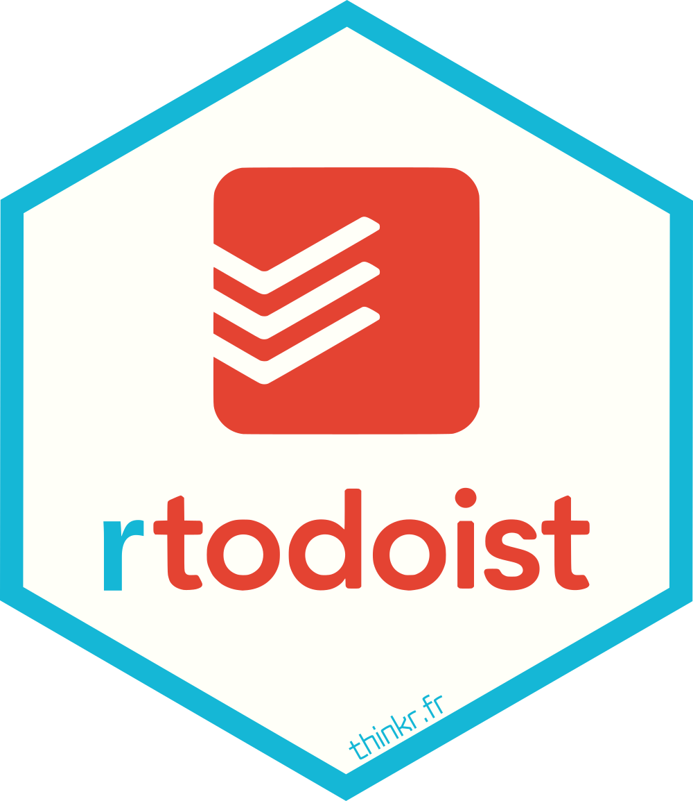

<!-- README.md is generated from README.Rmd. Please edit that file -->

# rtodoist 

<!-- badges: start -->

[](https://github.com/ThinkR-open/rtodoist/actions)
[](https://www.tidyverse.org/lifecycle/#stable)
[](https://CRAN.R-project.org/package=rtodoist)
<!-- badges: end -->

This package allows to use the todoist API. You will be able to add
projects and tasks to your todoist account.

To find information about todoist API :

<https://developer.todoist.com/sync/v8/#getting-started>

## Installation

You can install from CRAN :

``` r
install.packages("rtodoist")
```

You can install the development version of rtodoist with:

``` r
remotes::install_github("ThinkR-open/rtodoist")
```

## Example

``` r
library(todoist)

add_project("test") %>%
  add_task_in_project("my_task")
```

To find more details about the features, look at the ‘How it works’
vignette.
